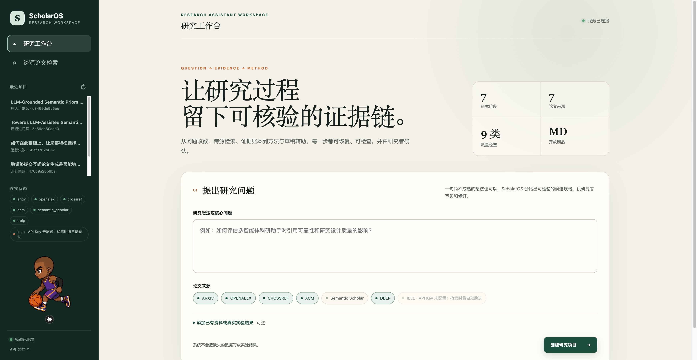
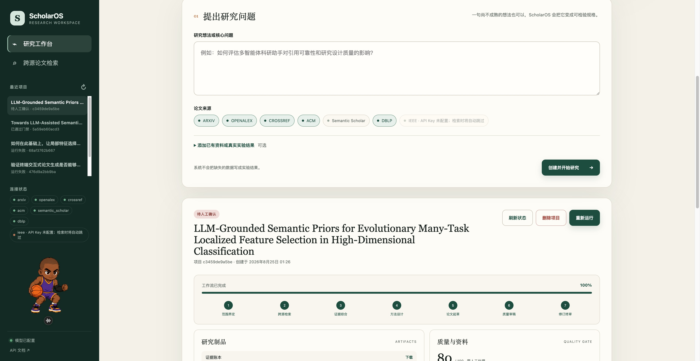
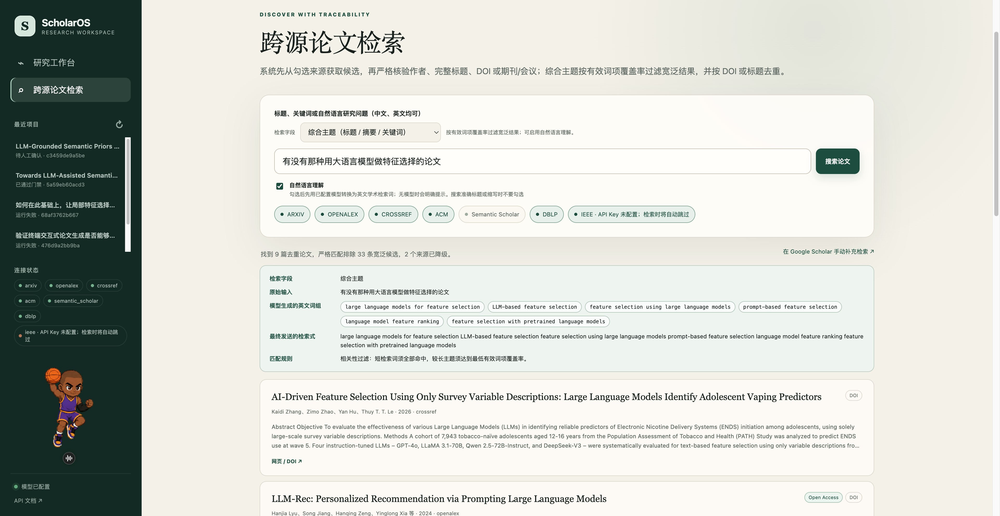
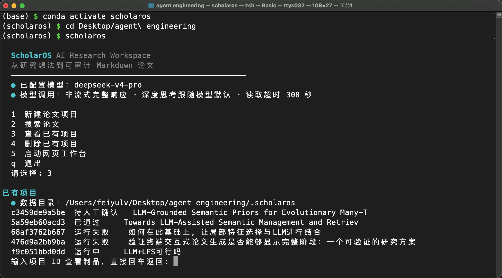
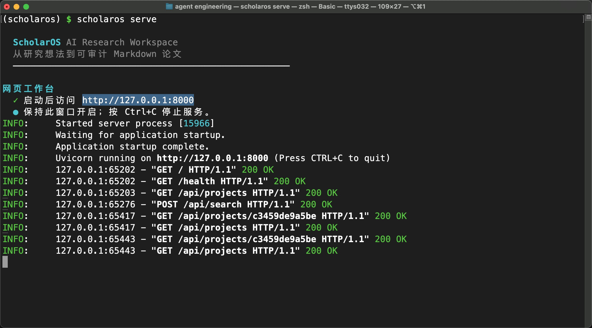
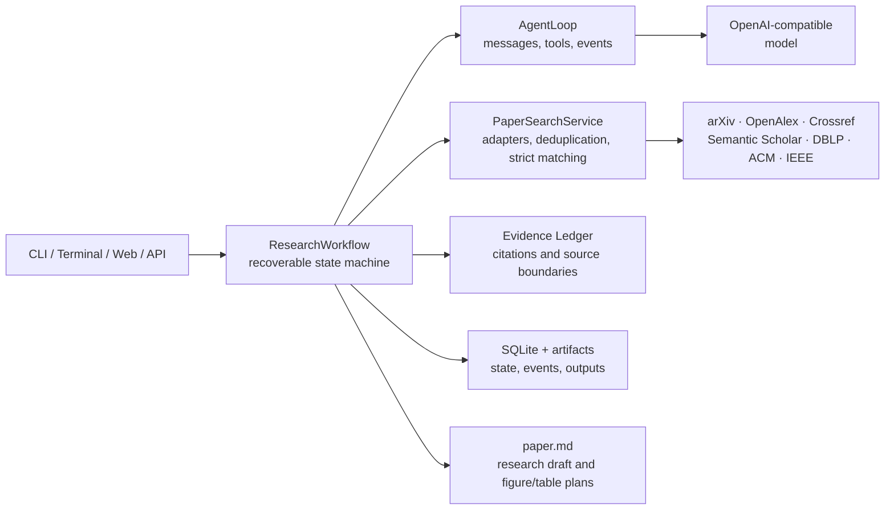

<div align="center">

# ScholarOS

A research assistant workspace for traceable evidence, method design, and writing support.

**English** | [简体中文](./README.zh-CN.md)

[](https://www.python.org/)
[](./LICENSE)
[](./scripts/check.sh)

[Quick start](#quick-start) · [Features](#features) · [Search](#search) · [Architecture](#architecture-overview) · [Documentation](#documentation) · [Contributing](./CONTRIBUTING.md)

</div>

ScholarOS organizes research assistance into seven recoverable stages and stores project state, search provenance, evidence, and generated artifacts:

```text
Question → Scope → Search → Evidence → Design → Draft → Review → Revision
```

The terminal CLI, and Web workspace share the same workflow. ScholarOS produces candidate research designs, evidence records, and research drafts; final judgment and academic responsibility remain with the researcher. When no experimental data is supplied, it produces a research protocol and figure/table design notes rather than invented results.

## Screenshots

<table>
  <tr>
    <td colspan="2" width="33.33%" align="center"><a href="./images/research-workspace-overview.jpg"></a><br><sub>Research Workspace Overview</sub></td>
    <td colspan="2" width="33.33%" align="center"><a href="./images/research-project-workflow.jpg"></a><br><sub>Research Project Workflow</sub></td>
    <td colspan="2" width="33.33%" align="center"><a href="./images/cross-source-paper-search.jpg"></a><br><sub>Cross-source Paper Search</sub></td>
  </tr>
  <tr>
    <td width="16.67%"></td>
    <td colspan="2" width="33.33%" align="center"><a href="./images/terminal-workspace.jpg"></a><br><sub>Terminal Workspace</sub></td>
    <td colspan="2" width="33.33%" align="center"><a href="./images/terminal-web-server.jpg"></a><br><sub>Terminal Web Server</sub></td>
    <td width="16.67%"></td>
  </tr>
</table>

## Positioning and responsibility

ScholarOS is a research assistance tool, not an autonomous paper author, and must not be used to bypass academic rules set by courses, institutions, or publishers. Its outputs are working materials that require human review; they are not submission-ready papers.

- Researchers must verify citations and claims against the original sources and decide the final research question, method, and analysis plan.
- Experimental execution, data integrity, result interpretation, ethics approval, authorship, and submission decisions cannot be delegated to the model.
- AI use should be disclosed according to the current rules of the relevant institution, funder, journal, or conference.
- Automated checks detect a limited set of structural and consistency issues; they do not replace supervisors, collaborators, statistical experts, or peer review.

## Features

- Assists with problem definition, hypotheses, method design, evidence ledgers, and Markdown research drafts.
- Accepts PDF, TXT, and Markdown files as references or experimental result materials.
- Searches arXiv, OpenAlex, Crossref, Semantic Scholar, DBLP, ACM metadata, and optional IEEE Xplore in parallel.
- Supports topic, natural-language, exact title, author, DOI, and venue searches; author searches can combine affiliation, topic, and venue constraints.
- Requires confirmation before sending search terms to external services and reports each source failure separately.
- Runs nine deterministic checks on both the initial and revised draft: section structure, evidence availability, in-text citations, method elements, figure design, table design, result provenance, researcher-responsibility statement, and draft depth.
- Persists project state and intermediate artifacts for inspection, reruns, and deletion.

## Quick start

### 1. Create the Conda environment

ScholarOS uses a Conda environment named `scholaros`; it does not create a second project-local Python environment:

```bash
conda env create -f environment.yml
conda activate scholaros
python -m pip install -e ".[dev]"
```

If the environment already exists:

```bash
conda env update -n scholaros -f environment.yml --prune
```

### 2. Configure a model (optional)

```bash
cp .env.example .env
```

Fill in an OpenAI-compatible model configuration in `.env`, for example DeepSeek. Keep `.env` local and never commit it. See [Environment configuration](./docs/environment.md) for details.

```dotenv
SCHOLAROS_MODEL=deepseek-chat
SCHOLAROS_API_BASE=https://api.deepseek.com
SCHOLAROS_API_KEY_ENV=DEEPSEEK_API_KEY
DEEPSEEK_API_KEY=your_api_key
```

### 3. Start the terminal workspace

```bash
scholaros
```

Running without arguments opens the interactive terminal menu. You can also run a project directly:

```bash
scholaros run "How can citation reliability in research agents be evaluated?" --offline
```

`--offline` is an explicit no-network demonstration mode. For real research, configure a model and paper sources, then inspect the outbound search plan.

### 4. Start without activating the environment

```bash
./scholaros.sh
./scholaros.sh serve
```

The launcher only invokes an installed Conda environment. It does not create an environment, install dependencies, or modify shell configuration. To use another environment:

```bash
SCHOLAROS_CONDA_ENV=my-research-env ./scholaros.sh serve
```

## Search

### Topic or natural-language search

```bash
scholaros search "How can research agents reduce citation errors?" --natural-language
```

Natural-language mode displays the original question, model-generated English search phrases, and the final query sent to paper sources. If the model is unavailable, ScholarOS reports the error instead of pretending that a translation was generated.

### Author search with combined constraints

```bash
scholaros search "Wei Wang" --field author \
  --affiliation "Shenzhen University" \
  --topic "computer vision" \
  --venue CVPR
```

Author, affiliation, topic, and venue are combined with AND semantics. OpenAlex, Crossref/ACM, and IEEE receive the constraints they support; Semantic Scholar verifies candidates within a bounded pagination budget. arXiv and DBLP explicitly skip an affiliation constraint when the current adapter cannot verify the author–affiliation relationship.

### Exact fields and venues

```bash
scholaros search CVPR --field venue
scholaros search "Attention Is All You Need" --field title
scholaros search "10.1145/1234567" --field doi --source acm
```

Results include a landing page, DOI link, and open PDF link when available. ScholarOS does not scrape Google Scholar; it provides a manual supplemental search link. No single index can promise complete coverage of everything discoverable through Google Scholar.

## Web workspace

```bash
scholaros serve
```

Open `http://127.0.0.1:8000`; API documentation is available at `/docs`. The Web workspace supports project creation, document upload, outbound search-plan confirmation, stage monitoring, artifact download, safe reruns, and project deletion.

## Project data and output

ScholarOS stores local data in `.scholaros/` by default:

```text
.scholaros/
├── scholaros.db          # projects, state, and events
└── artifacts/
    └── <project-id>/     # uploaded text, search records, and paper.md
```

Both `.scholaros/` and `.env` are ignored by Git. Before publishing code, filing an issue, or sharing logs, still check that they contain no private papers, personal information, or secrets.

## Architecture overview



The repository uses a standard `src` layout:

```text
.
├── src/scholaros/       # installable package, CLI, API, workflow, and Web assets
├── tests/               # unit, source-adapter, API, workflow, and end-to-end tests
├── docs/                # environment, architecture, code, permissions, and product docs
├── examples/            # minimal public examples
├── scripts/             # reusable checks and maintenance scripts
├── environment.yml      # Conda environment definition
├── pyproject.toml       # package metadata, dependencies, entry points, tool config
├── scholaros.sh         # Conda launcher for use without environment activation
└── README.md
```

See [Architecture](./docs/architecture.md) and [Code guide](./docs/code-guide.md) for extension points.

## Development

```bash
conda activate scholaros
python -m pip install -e ".[dev]"
./scripts/check.sh
```

To add a paper source, implement the shared `PaperSource` adapter interface and preserve landing links, PDF links, source errors, and permission boundaries. Read the [contribution guide](./CONTRIBUTING.md) before submitting changes.

## Permissions and limitations

- Metadata, abstracts, open full text, and subscription full text are separate permission layers. Finding a DOI or PDF link does not grant redistribution or training rights.
- The ACM adapter currently searches `10.1145` metadata through Crossref; it does not scrape the ACM Digital Library.
- IEEE Xplore requires an official API key. A university web login is not the same as API or text-and-data-mining authorization.
- ScholarOS does not bypass paywalls, CAPTCHAs, robots restrictions, browser cookies, or institutional licenses.
- The current release is a local, single-process workspace. A multi-user deployment needs a task queue, concurrent database controls, authentication, and audit infrastructure.
- Evidence synthesis still requires verification against the original text. OCR, experiment execution, generated result figures, and computed result tables are outside the current MVP.
- Passing automated checks does not prove that a conclusion is correct, that a manuscript meets submission requirements, or that it complies with an institution's academic-integrity policy.

See [Paper-source permissions and compliance](./docs/permissions.md) for details.

## Documentation

- [Documentation index](./docs/README.md)
- [Environment configuration](./docs/environment.md)
- [Architecture](./docs/architecture.md)
- [Code guide](./docs/code-guide.md)
- [Research assistance and academic integrity](./docs/research-integrity.md)
- [Permissions and compliance](./docs/permissions.md)
- [Product positioning](./docs/product.md)
- [Contributing](./CONTRIBUTING.md)
- [Security](./SECURITY.md)

## License

[MIT](./LICENSE)
