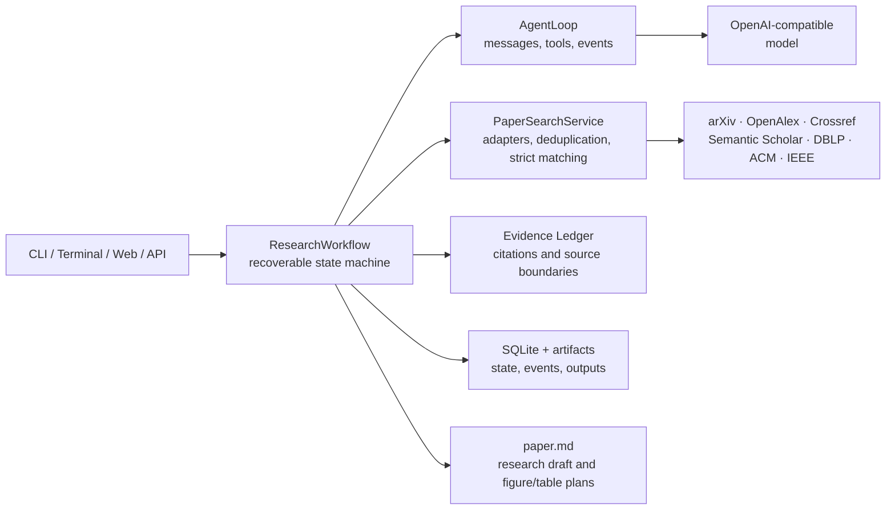

<div align="center">

# ScholarOS

A research assistant workspace for traceable evidence, method design, and writing support.

**English** | [简体中文](./README.zh-CN.md)

[](./pyproject.toml)
[](https://www.python.org/)
[](./LICENSE)
[](./scripts/check.sh)

[Quick start](#quick-start) · [News](#news) · [Features](#features) · [Architecture](#architecture-overview) · [Documentation](#documentation) · [Contributing](./CONTRIBUTING.md)

</div>

ScholarOS organizes research assistance into seven recoverable stages and stores project state, search provenance, evidence, and generated artifacts:

```text
Question → Scope → Search → Evidence → Design → Draft → Review → Revision
```

The terminal CLI and Web workspace share the same workflow. ScholarOS produces candidate research designs, evidence records, and research drafts; final judgment and academic responsibility remain with the researcher. When no experimental data is supplied, it produces a research protocol and figure/table design notes rather than invented results.

## 📢 News

<details>
<summary>September 23, 2026 · v0.3.1 — Consistency fixes and multilingual support</summary>

- README no longer advertises the removed standalone cross-source paper search; the workflow's research-materials stage is described instead.
- English and bilingual research drafts now pass the nine deterministic quality checks correctly.
- LaTeX output containing Chinese now uses `ctexart` (XeLaTeX); pure-English drafts keep the IEEEtran journal template.
- The submission package is no longer unconditionally blocked by the author/ethics metadata reminder.
- Model-discovered papers in the workflow now pass the same relevance filter as fixed sources.

</details>

<details>
<summary>September 22, 2026 · v0.3.0 — Interactive research workspace</summary>

- Stage-by-stage interaction is now the default for Web, CLI, and terminal entry points; use `--automatic` when you explicitly want one-step execution.
- Running projects can be interrupted and resumed from the saved checkpoint.
- Every completed stage and the final workflow are saved to a project version timeline; historical versions can be opened directly in the current project view as read-only snapshots.
- Figure plans render Mermaid flowcharts and table plans render as readable tables.
- The Web workspace uses a calm blue-gray visual theme and a simplified project/material overview; API documentation remains available at `/docs`.
- LaTeX output uses the local English IEEEtran journal template stored under `templates/ieee/`.

</details>

## Screenshots

<table>
  <tr>
    <td width="33.33%" align="center"><a href="./images/ScholarOSv0.3.1-home.jpg"></a><br><sub>Home</sub></td>
    <td width="33.33%" align="center"><a href="./images/ScholarOSv0.3.1-project.jpg"></a><br><sub>Project</sub></td>
    <td width="33.33%" align="center"><a href="./images/ScholarOSv0.3.1-detail.jpg"></a><br><sub>Detail</sub></td>
  </tr>
</table>

## Positioning and responsibility

ScholarOS is a research assistance tool, not an autonomous paper author, and must not be used to bypass academic rules set by courses, institutions, or publishers. Its outputs are working materials that require human review; they are not submission-ready papers.

- Researchers must verify citations and claims against the original sources and decide the final research question, method, and analysis plan.
- Experimental execution, data integrity, result interpretation, ethics approval, authorship, and submission decisions cannot be delegated to the model.
- AI use should be disclosed according to the current rules of the relevant institution, funder, journal, or conference.
- Automated checks detect a limited set of structural and consistency issues; they do not replace supervisors, collaborators, statistical experts, or peer review.

## Features

- Assists with problem definition, hypotheses, method design, evidence ledgers, and Markdown research drafts.
- Supports six work types: build from materials, rewrite, integrity audit, independent review, revision, and target transfer. Project configuration records venue/scene, language, research boundary, author voice, learning targets, reference target, and figure policy.
- Accepts PDF, DOCX, TXT, Markdown, TeX, BibTeX, CSV, and JSON as references or experimental result materials.
- Gathers and deduplicates candidate papers in the research-materials stage from arXiv, OpenAlex, Crossref, Semantic Scholar, DBLP, and ACM metadata.
- Shows a search-plan confirmation for projects with uploaded references and for guided projects; reports each source failure separately.
- Runs nine deterministic checks on both the initial and revised draft: section structure, evidence availability, in-text citations, method elements, figure design, table design, result provenance, researcher-responsibility statement, and draft depth.
- Uses stage-by-stage checkpoints by default, supports explicit interruption and resume, and automatically saves a version after every completed stage and after final completion.
- Keeps one reviewable contribution blueprint, detailed evidence files, figure/table plans, stage-confirmed revisions, and a read-only version timeline in the same project; affected downstream artifacts remain stale until regenerated.
- Prepares editable Markdown and English IEEEtran LaTeX outputs plus a hash manifest and local ZIP. Markdown can be previewed as a paper and printed to PDF from the project page; local delivery never means automatic submission.

## Quick start

### 1. Create the Conda environment

Create the `scholaros` Conda environment. Its definition also installs the project and development dependencies:

```bash
conda env create -f environment.yml
conda activate scholaros
```

If the environment already exists:

```bash
conda env update -n scholaros -f environment.yml --prune
```

### 2. Configure a model (optional)

```bash
cp .env.example .env
```

Fill in an OpenAI-compatible model configuration in `.env`, for example DeepSeek. Keep `.env` local and never commit it. See [Environment configuration](./docs/environment.md) for details.

```dotenv
SCHOLAROS_MODEL=deepseek-chat
SCHOLAROS_API_BASE=https://api.deepseek.com
SCHOLAROS_API_KEY_ENV=DEEPSEEK_API_KEY
DEEPSEEK_API_KEY=your_api_key
```

### 3. Start the terminal workspace

```bash
scholaros
```

Running without arguments opens the interactive terminal menu. You can also run a project directly:

```bash
scholaros run "How can citation reliability in research agents be evaluated?" --offline
```

`--offline` is an explicit no-network demonstration mode. For real research, configure a model and paper sources, then inspect the outbound search plan.

### Work step by step

Terminal and Web projects now use stage-by-stage interaction by default. The workflow pauses after every stage; you can save an edit, rerun the current stage, and approve it before continuing. Choose one-step execution or pass `--automatic` only when you want the remaining stages to run continuously. Search terms are still confirmed separately before being sent to paper sources.

```bash
scholaros run "How can citation reliability in research agents be evaluated?"             # interactive by default
scholaros run "How can citation reliability in research agents be evaluated?" --automatic # one-step
scholaros show PROJECT_ID
scholaros approve PROJECT_ID                       # approve the pending stage
scholaros confirm-search PROJECT_ID                # approve outbound search terms
scholaros resume PROJECT_ID                        # retry an interrupted stage
scholaros rerun PROJECT_ID --from-stage designing  # keep scope, search, and evidence
scholaros history PROJECT_ID
scholaros delivery PROJECT_ID                      # build editable outputs and a local package
```

These are separate actions; use the command for the project's current state. Stage-by-stage interaction is the default; use `--automatic` for one-step execution. This release supports stage-level review and reruns, not conversational editing of each section. See [Guided work and recovery](./docs/workflow.md) for details and history-storage limits.

### 4. Start without activating the environment

```bash
./scholaros.sh
./scholaros.sh serve
```

The launcher only invokes an installed Conda environment. It does not create an environment, install dependencies, or modify shell configuration. To use another environment:

```bash
SCHOLAROS_CONDA_ENV=my-research-env ./scholaros.sh serve
```

## Web workspace

```bash
scholaros serve
```

Open `http://127.0.0.1:8000`; API documentation is available at `/docs`. The Web workspace supports full project intake, document upload, a reviewable contribution blueprint, outbound search-plan confirmation, stage-by-stage confirmed edits, detailed evidence files and figure/table plans, Markdown/LaTeX source preview, quality findings, interruption/resume, automatic version timelines, read-only historical project views, and project deletion. See [Project workbench and delivery](./docs/workbench.md).

## Project data and output

ScholarOS stores local data in `.scholaros/` by default:

```text
.scholaros/
├── scholaros.db          # projects, state, and events
└── artifacts/
    └── <project-id>/     # uploaded text, JSON records, drafts, editable exports, and delivery ZIP
```

Both `.scholaros/` and `.env` are ignored by Git. Before publishing code, filing an issue, or sharing logs, still check that they contain no private papers, personal information, or secrets.

## Architecture overview



The repository uses a standard `src` layout:

```text
.
├── src/scholaros/       # installable package, CLI, API, workflow, and Web assets
├── tests/               # unit, source-adapter, API, workflow, and end-to-end tests
├── docs/                # environment, architecture, code, permissions, and product docs
├── examples/            # minimal public examples
├── scripts/             # reusable checks and maintenance scripts
├── environment.yml      # Conda environment definition
├── pyproject.toml       # package metadata, dependencies, entry points, tool config
├── scholaros.sh         # Conda launcher for use without environment activation
└── README.md
```

See [Architecture](./docs/architecture.md) and [Code guide](./docs/code-guide.md) for extension points.

## Development

```bash
conda activate scholaros
python -m pip install -e ".[dev]"
./scripts/check.sh
```

To add a paper source, implement the shared `PaperSource` adapter interface and preserve landing links, PDF links, source errors, and permission boundaries. Read the [contribution guide](./CONTRIBUTING.md) before submitting changes.

## Permissions and limitations

- Metadata, abstracts, open full text, and subscription full text are separate permission layers. Finding a DOI or PDF link does not grant redistribution or training rights.
- The ACM adapter currently searches `10.1145` metadata through Crossref; it does not scrape the ACM Digital Library.
- IEEE Xplore requires an official API key. A university web login is not the same as API or text-and-data-mining authorization.
- ScholarOS does not bypass paywalls, CAPTCHAs, robots restrictions, browser cookies, or institutional licenses.
- The current release is a local, single-process workspace. A multi-user deployment needs a task queue, concurrent database controls, authentication, and audit infrastructure.
- Evidence synthesis still requires verification against the original text. OCR, experiment execution, generated result figures, and computed result tables are outside the current MVP.
- Passing automated checks does not prove that a conclusion is correct, that a manuscript meets submission requirements, or that it complies with an institution's academic-integrity policy.

See [Paper-source permissions and compliance](./docs/permissions.md) for details.

## Documentation

- [Documentation index](./docs/README.md)
- [Environment configuration](./docs/environment.md)
- [Guided work and recovery](./docs/workflow.md)
- [Project workbench and delivery](./docs/workbench.md)
- [Architecture](./docs/architecture.md)
- [Code guide](./docs/code-guide.md)
- [Research assistance and academic integrity](./docs/research-integrity.md)
- [Permissions and compliance](./docs/permissions.md)
- [Product positioning](./docs/product.md)
- [Contributing](./CONTRIBUTING.md)
- [Security](./SECURITY.md)

## License

[MIT](./LICENSE)
