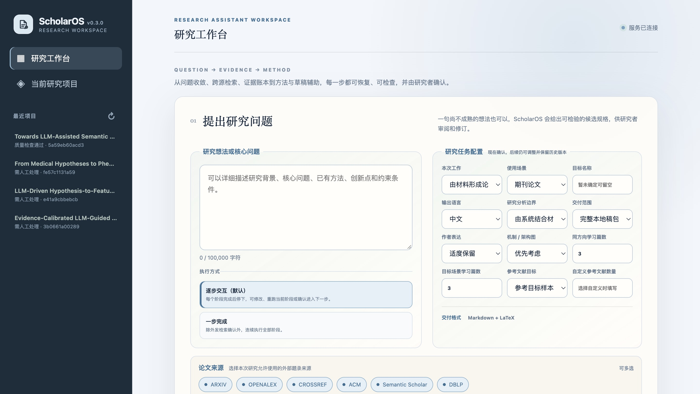
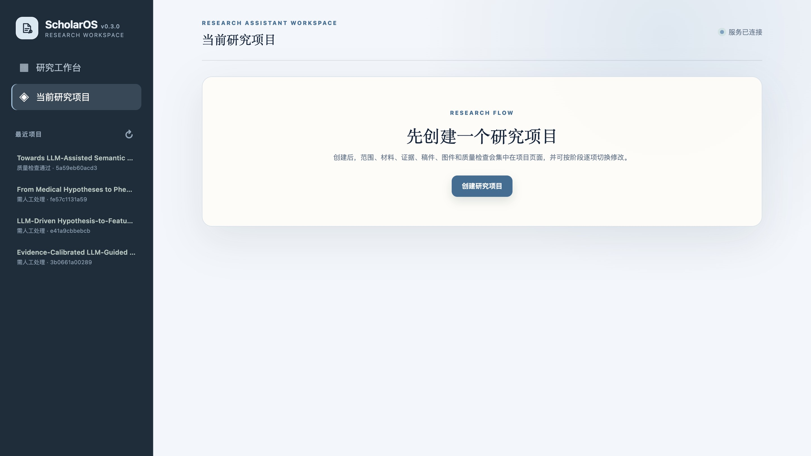
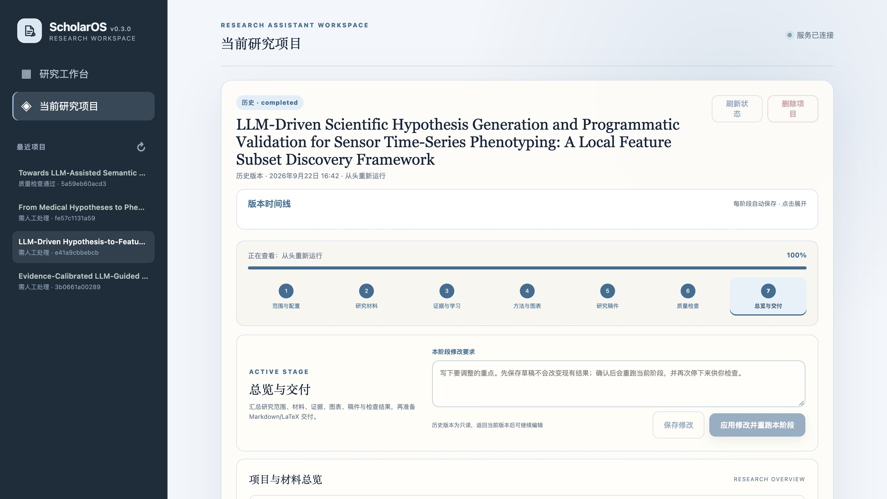
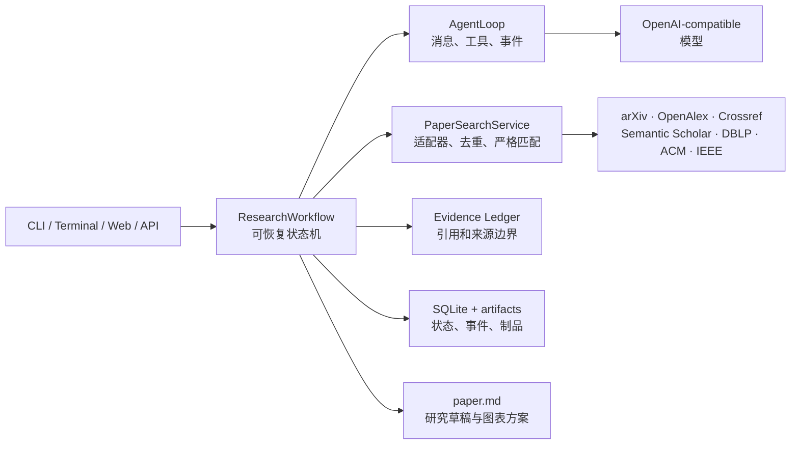

<div align="center">

# ScholarOS

面向研究者的证据追踪、方法设计与写作辅助工作台。

[English](./README.md) | **简体中文**

[](./pyproject.toml)
[](https://www.python.org/)
[](./LICENSE)
[](./scripts/check.sh)

[快速开始](#快速开始) · [最近更新](#最近更新) · [功能](#功能) · [检索](#检索) · [架构](#架构概览) · [文档](#文档) · [贡献](./CONTRIBUTING.zh-CN.md)

</div>

ScholarOS 把研究过程拆成七个可恢复阶段，并保存项目状态、检索来源、证据和生成制品：

```text
Question → Scope → Search → Evidence → Design → Draft → Review → Revision
```

终端命令行和 Web 工作台共用同一套工作流。系统提供候选研究方案、证据记录和研究草稿，最终判断与学术责任始终由研究者承担。没有实验数据时，只输出研究方案以及图表、表格的设计说明，不生成虚构结果。

## 📰 最近更新

### 2026 年 9 月 22 日 · v0.3.0 —— 交互式研究工作台

- Web、CLI 和终端入口默认采用逐阶段交互；明确选择 `--automatic` 时才一步完成。
- 运行中的项目可以中断，并从保存的断点继续。
- 每个完成阶段和最终工作流都会自动保存到项目版本时间线；点击历史版本可在“当前研究项目”中以只读方式查看当时的完整状态。
- 图件规划支持 Mermaid 流程图，表格规划支持可读表格呈现。
- Web 工作台改为冷静蓝灰主题，最后阶段聚合为项目与材料总览；API 文档仍可通过 `/docs` 访问。
- LaTeX 输出统一使用仓库 `templates/ieee/` 中的英文 IEEEtran 期刊模板。

## 产品截图

<table>
  <tr>
    <td width="33.33%" align="center"><a href="./images/ScholarOSv0.3.0-home.jpg"></a><br><sub>首页</sub></td>
    <td width="33.33%" align="center"><a href="./images/ScholarOSv0.3.0-project.jpg"></a><br><sub>项目</sub></td>
    <td width="33.33%" align="center"><a href="./images/ScholarOSv0.3.0-detail.jpg"></a><br><sub>详情</sub></td>
  </tr>
</table>

## 定位与责任

ScholarOS 是科研辅助工具，不是自动论文作者，也不应被用于绕过课程、机构或期刊的学术规范。系统输出属于需要人工审阅的工作材料，不能直接视为可投稿论文。

- 研究者需要回到原文核验引用和论断，决定研究问题、方法与分析方案。
- 实验执行、数据真实性、结果解释、伦理审批、作者署名和投稿决定不能交给模型。
- 使用 AI 的范围应按照所在机构、资助方及目标期刊或会议的规则如实披露。
- 质量检查只能发现一部分结构和一致性问题，不能替代导师、合作者、统计专家或同行评议。

## 功能

- 辅助形成问题定义、假设、方法设计、证据账本和 Markdown 研究草稿。
- 支持由材料成稿、重写、科研诚信核查、独立审阅、按意见返修和适配新目标六类任务；项目配置记录目标场景、语言、研究边界、作者表达、学习篇数、参考文献目标、图件策略和交付格式。
- 将 PDF、DOCX、TXT、Markdown、TeX、BibTeX、CSV 和 JSON 作为参考资料或实验结果加入项目。
- 并行检索 arXiv、OpenAlex、Crossref、Semantic Scholar、DBLP、ACM 元数据和可选 IEEE Xplore。
- 支持综合主题、自然语言、标题、作者、DOI 和期刊/会议检索；作者条件可叠加机构、主题和会议。
- 上传参考资料的项目和引导式项目在外发检索词前等待确认，并单独报告每个论文源的失败原因。
- 对初稿和修订稿执行 9 类确定性质量检查：章节结构、证据、引用、方法要素、图设计、表设计、结果来源、研究者责任声明和正文完整度。
- 默认逐步确认；运行中可中断并从断点继续，每个阶段完成后以及最终完成时都会自动保存项目版本。
- 在同一项目保存可直接修改的贡献方案、证据文件、图表规划、阶段确认修改和版本时间线；影响下游的变化会将旧制品标为待更新，继续运行后再替换。
- 生成 Markdown、基于本地英文 IEEEtran 期刊模板的 LaTeX 可编辑稿、哈希清单和本地 ZIP；Markdown 可在项目页按纸张样式预览并打印为 PDF，也不会自动投稿或发布。

## 快速开始

### 1. 创建 Conda 环境

创建名为 `scholaros` 的 Conda 环境；环境文件已包含项目及开发依赖的安装：

```bash
conda env create -f environment.yml
conda activate scholaros
```

如环境已经存在：

```bash
conda env update -n scholaros -f environment.yml --prune
```

### 2. 配置模型（可选）

```bash
cp .env.example .env
```

然后在 `.env` 中填写 OpenAI-compatible 模型配置，例如 DeepSeek。`.env` 只保留在本机，绝不提交到 GitHub。完整说明见[环境配置](./docs/zh-CN/environment.md)。

DeepSeek 示例：

```dotenv
SCHOLAROS_MODEL=deepseek-chat
SCHOLAROS_API_BASE=https://api.deepseek.com
SCHOLAROS_API_KEY_ENV=DEEPSEEK_API_KEY
DEEPSEEK_API_KEY=你的_API_Key
```

### 3. 启动终端工作台

```bash
scholaros
```

无参数会打开中文交互菜单。也可以直接使用：

```bash
scholaros run "如何评估科研智能体的引用可靠性？" --offline
```

`--offline` 是明确的无外部检索演示模式；正式研究应配置模型、论文源并检查外发检索计划。

### 一步步推进研究

终端和 Web 默认使用逐步交互模式：系统在每个阶段完成后停下，等你检查；你可以保存修改并重跑当前阶段，再确认进入下一阶段。只有明确选择“一步完成”或使用 `--automatic` 时才连续执行。外发检索词仍另行确认。

```bash
scholaros run "如何评估科研智能体的引用可靠性？"          # 默认逐步交互
scholaros run "如何评估科研智能体的引用可靠性？" --automatic  # 一步完成
scholaros show PROJECT_ID
scholaros approve PROJECT_ID                       # 确认当前阶段
scholaros confirm-search PROJECT_ID                # 确认外发检索词
scholaros resume PROJECT_ID                        # 重试中断的阶段
scholaros rerun PROJECT_ID --from-stage designing  # 保留范围、检索和证据
scholaros history PROJECT_ID
scholaros delivery PROJECT_ID                      # 生成可编辑格式与本地交付包
```

这些是分别使用的操作，请按项目当前状态选择。默认按阶段交互；只有 `--automatic` 才采用一步完成模式。当前支持阶段级检查和重做，尚不支持逐章对话编辑。完整操作和历史存储边界见[分步研究与恢复](./docs/zh-CN/workflow.md)。

### 4. 不激活环境时启动

```bash
./scholaros.sh
./scholaros.sh serve
```

启动器只调用已安装的 Conda 环境，不自动创建环境、安装依赖或修改 Shell 配置。需要使用其他环境时：

```bash
SCHOLAROS_CONDA_ENV=my-research-env ./scholaros.sh serve
```

## 检索

### 综合主题或自然语言

```bash
scholaros search "如何减少科研智能体产生的错误引用？" --natural-language
```

自然语言模式会显示原始问题、模型生成的英文检索词组和最终发送给论文源的检索式。模型不可用时会明确报错，不伪造翻译结果。

### 作者组合条件

```bash
scholaros search "Wei Wang" --field author \
  --affiliation "Shenzhen University" \
  --topic "computer vision" \
  --venue CVPR
```

作者、机构、主题和会议按 AND 组合。OpenAlex、Crossref/ACM 和 IEEE 会把可支持的条件下推到来源；Semantic Scholar 会在有限候选预算内分页核验。arXiv 与 DBLP 当前无法核验作者—机构对应关系时会明确跳过该条件。

### 顶会和精确字段

```bash
scholaros search CVPR --field venue
scholaros search "Attention Is All You Need" --field title
scholaros search "10.1145/1234567" --field doi --source acm
```

每条结果尽可能提供论文网页、DOI 和开放 PDF 链接。ScholarOS 不抓取 Google Scholar，而是提供组合条件的手动补充检索链接；没有单一索引可以承诺覆盖 Google Scholar 的全部内容。

## Web 工作台

```bash
scholaros serve
```

浏览器打开 `http://127.0.0.1:8000`，API 文档位于 `/docs`。Web 工作台支持完整任务配置、上传资料、直接修改研究贡献方案、确认外发检索计划、分阶段保存并确认修改、逐条查看证据与图表规划、预览 Markdown/LaTeX 原文、查看质量问题、中断/断点继续、版本时间线、只读历史项目视图和项目删除。详见[项目工作台与交付](./docs/zh-CN/workbench.md)。

## 项目数据与输出

ScholarOS 默认将本地数据保存在 `.scholaros/`：

```text
.scholaros/
├── scholaros.db          # 项目、状态和事件
└── artifacts/
    └── <project-id>/     # 上传文本、JSON 记录、稿件、可编辑导出与交付 ZIP
```

该目录和 `.env` 均已加入 `.gitignore`。发布代码、提交 Issue 或分享日志前，仍应检查其中是否包含未公开论文、个人信息或密钥。

## 架构概览



代码采用标准 `src` layout：

```text
.
├── src/scholaros/       # 可安装 Python 包、CLI、API、workflow、Web 静态资源
├── tests/               # 单元、来源适配器、API、工作流和端到端测试
├── docs/                # 环境、架构、代码、权限与产品文档
├── examples/            # 可公开分享的最小输入示例
├── scripts/             # 可复用的检查和维护脚本
├── environment.yml      # Conda 环境定义
├── pyproject.toml       # 包元数据、依赖、入口和工具配置
├── scholaros.sh         # 不激活环境时使用的 Conda 启动脚本
└── README.md
```

关键设计与扩展入口见[架构思路](./docs/zh-CN/architecture.md)和[代码说明](./docs/zh-CN/code-guide.md)。

## 开发

```bash
conda activate scholaros
python -m pip install -e ".[dev]"
./scripts/check.sh
```

新增论文源时，实现统一的 `PaperSource` 适配器，并保留网页链接、PDF 链接、来源错误和权限边界。贡献前请阅读[贡献指南](./CONTRIBUTING.zh-CN.md)。

## 权限与限制

- 元数据、摘要、开放全文和订阅全文是不同权限；检索到 DOI 或 PDF 链接不等于拥有再分发或训练权利。
- ACM 当前通过 Crossref 的 `10.1145` 元数据检索，不抓取 ACM Digital Library 页面。
- IEEE Xplore 需要官方 API key；学校网页登录不等于 API/TDM 批量全文授权。
- ScholarOS 不绕过付费墙、验证码、机器人限制、浏览器 cookie 或机构许可。
- 当前定位是单机、单进程研究工作台；生产多用户部署需要独立任务队列、数据库并发控制、认证和审计基础设施。
- 证据综合仍需研究者回到原文核验；OCR、实验代码执行、真实图像生成和真实表格计算不在当前 MVP 范围内。
- 自动检查通过不代表研究结论正确、符合投稿要求或满足所在机构的学术诚信政策。

详细边界见[论文源权限与合规](./docs/zh-CN/permissions.md)。

## 文档

- [文档索引](./docs/zh-CN/README.md)
- [环境配置](./docs/zh-CN/environment.md)
- [分步研究与恢复](./docs/zh-CN/workflow.md)
- [项目工作台与交付](./docs/zh-CN/workbench.md)
- [架构思路](./docs/zh-CN/architecture.md)
- [代码说明](./docs/zh-CN/code-guide.md)
- [科研辅助与学术诚信](./docs/zh-CN/research-integrity.md)
- [权限与合规](./docs/zh-CN/permissions.md)
- [产品定位](./docs/zh-CN/product.md)
- [贡献指南](./CONTRIBUTING.zh-CN.md)
- [安全说明](./SECURITY.zh-CN.md)

## 许可证

[MIT](./LICENSE)
