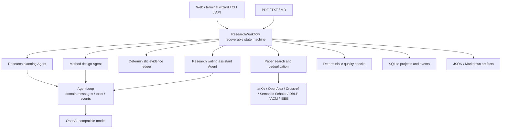
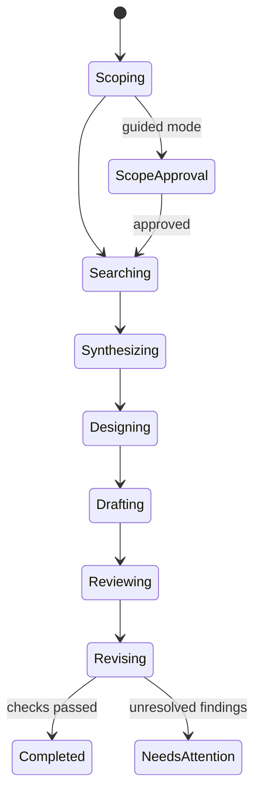
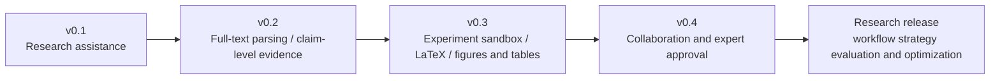

# ScholarOS Architecture

**English** | [简体中文](./zh-CN/architecture.md)

## In one sentence

ScholarOS combines a research-assistance state machine, an event-driven Agent runtime, an evidence ledger, and pluggable reasoning and search engines. The system organizes materials and candidate plans; researchers make academic decisions.

## System overview

## Seven-stage research state machine

Each stage persists its current state before execution, stores artifacts on completion, and advances the saved cursor. `resume` retries the interrupted stage without repeating completed upstream work; it does not bypass a pending confirmation. Optional guided mode pauses after scope, evidence, design, and drafting, with a separate outbound-search confirmation. See [Guided work and recovery](workflow.md) for all checkpoints and actions. A single paper-source failure is recorded; zero total results still stop a normal workflow.

## Runtime design choices

| Design principle | ScholarOS implementation |
|---|---|
| Domain messages through the loop | `AgentMessage` stores role, tools, and provenance metadata; conversion happens only at the model boundary |
| Streaming lifecycle events | Turn, message, tool, and project-stage events |
| Tool validation and capability control | Minimal JSON Schema validation plus per-Agent tool allowlists |
| Steering and follow-up | Separate queues prepared for future real-time correction |
| Durable session/context | SQLite project snapshots, event logs, and stage artifacts |
| Multi-model adaptation | `TurnModel` protocol and OpenAI-compatible implementation |

ScholarOS does not include a general coding agent's terminal tools, TUI, or TypeScript package structure. Its core objects are research questions, papers, evidence, methods, and drafts.

## Why Agents are not separate microservices

In the current release, an “Agent” is a role with a distinct objective, prompt, and quality boundary. Roles share one project state and evidence protocol. This design:

- runs on one computer without operational overhead;
- reproduces each stage accurately;
- avoids information loss from repeated inter-Agent paraphrasing;
- can later split stages into queues if horizontal scaling becomes necessary.

Multi-Agent behavior is defined by role objectives, capability permissions, input/output contracts, and review relationships—not by process count.

## Trust design

1. **Citation allowlist:** writing may only use stable citation keys from the evidence ledger.
2. **Transparent source degradation:** every failed source enters project state; the system cannot silently claim complete coverage.
3. **Metadata/full-text separation:** a DOI or abstract does not imply authorized full-text access.
4. **Result integrity:** without `results` material, the output is a registered-report-style draft; result values must be located in uploaded result material or the check fails.
5. **Deterministic checks:** initial and revised drafts are checked for structure, evidence, in-text citation consistency, method reproducibility elements, figure design, table design, result provenance, researcher responsibility, and draft depth.
6. **Artifact-first workflow:** each stage emits JSON or Markdown that users can inspect, edit, and version.
7. **Source-topic anchoring:** uploaded source material participates in scoping, and a phrase verifiable in one source excerpt prevents acronym collisions from changing the domain; filenames and cross-document concatenation are not evidence.
8. **Human authorization before outbound search:** PDFs are untrusted input. A project with source documents stores its title and query plan before contacting third parties, and waits for user confirmation. A rejected plan can revise the research description and return to scoping. Cross-language or sensitive phrases generate warnings rather than static keyword bans.
9. **Safe grouped search:** outbound terms are checked for structure and topic relation; complementary query clusters retain coverage. A source that rate-limits or fails is not repeatedly hit in the same batch.
10. **Empty-search stop:** a normal workflow stops before writing when no paper is found and exposes queries plus filter statistics. Only explicit offline demonstration mode can bypass this stop.
11. **Artifact isolation on rerun:** first snapshot project state and generated artifacts, then invalidate the selected stage and its downstream outputs. Upstream results and uploaded text remain. A full restart invalidates every generated stage; old versions remain under `history/` until the project is deleted.
12. **Researcher final responsibility:** outputs are candidate plans and reviewable drafts. Original-source verification, method choice, experiments, interpretation, ethics, authorship, and submission remain human responsibilities.

## From MVP to research platform

RL should not begin by training an LLM. After sufficient events, check outcomes, and user feedback exist, it could optimize workflow decisions such as when to search, what to read, which role to call, and when to request human confirmation.

The current release is a local, single-process MVP. The API rejects duplicate starts and uploads during a run. A multi-process or multi-user deployment still requires PostgreSQL row locking and a task queue; SQLite must not be treated as a distributed scheduler.

All interaction layers use the same core call chain. The terminal wizard displays seven-stage events through a synchronous progress callback. The Web interface creates a project and uploads documents before scheduling a background run, then polls persisted state. Neither interface duplicates research logic.
