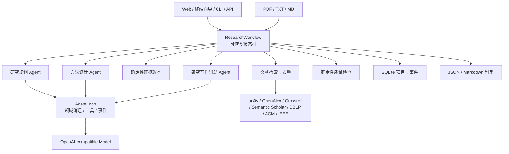
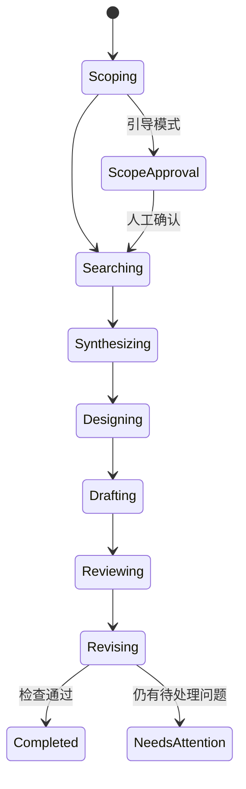
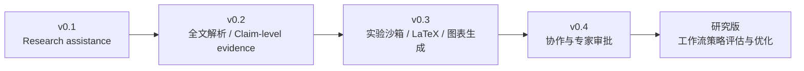

# ScholarOS 架构思路

[English](../architecture.md) | **简体中文**

## 一句话

ScholarOS 是“科研辅助状态机 + 事件化 Agent runtime + 证据账本 + 可插拔认知与检索引擎”。系统负责组织材料和候选方案，研究者负责学术判断。

## 总体结构

## 七阶段研究状态机

每个阶段先保存当前状态再执行，完成后保存制品并推进持久化游标。`resume` 重试中断阶段，不重复已完成的上游工作，也不跳过待确认环节。可选引导模式在范围、证据、方法和初稿完成后暂停；外发检索计划另行确认。完整确认点与操作见[分步研究与恢复](workflow.md)。单一论文源失败会记录；总命中为零时仍会阻止正常流程继续。

## Runtime 设计取舍

| 设计原则 | ScholarOS 落地 |
|---|---|
| 领域消息贯穿循环 | `AgentMessage` 保存角色、工具、来源元数据；模型边界才转换 |
| 流式事件生命周期 | turn/message/tool 事件 + 项目 stage 事件 |
| 工具验证和能力控制 | JSON Schema 的最小验证 + Agent 工具白名单 |
| steering / follow-up | 分离队列，为未来用户实时纠偏准备 |
| session/context 可持续 | SQLite 项目快照、事件日志和阶段制品 |
| 多模型适配 | `TurnModel` 协议和 OpenAI-compatible 实现 |

没有引入通用 coding agent 的终端工具、TUI 和 TypeScript 包结构，因为科研系统的核心对象应是研究问题、论文、证据、方法和稿件。

## 多 Agent 为什么不拆成微服务

当前“Agent”是不同职责、提示和质量边界的角色；它们共享一个项目状态和证据协议。这样可以：

- 在一台电脑零运维运行；
- 准确重现每个阶段；
- 避免 Agent 之间反复转述造成信息损失；
- 将来需要水平扩展时，再按阶段队列拆分。

是否是多 Agent 不由进程数量决定，而由角色目标、能力权限、输入输出契约和审查关系决定。

## 可信度设计

1. **引用白名单：** 写作只能使用证据账本中的稳定引用键。
2. **来源降级透明：** 每个失败源都进入项目状态，不能静默假装覆盖完整。
3. **元数据与全文分层：** DOI/摘要可得不等于正文有权访问。
4. **结果诚信：** 无 `results` 资料时输出注册报告；结果性数值必须能在已上传结果资料中定位，否则质量检查不通过。
5. **确定性质量检查：** 初稿和修订稿都检查章节结构、证据存在、引用一致性、方法可复现要素、图设计、表设计、结果来源、研究者责任声明和正文完整度。
6. **制品优先：** 每阶段留 JSON/Markdown，用户可以检查、编辑和版本控制。
7. **资料主题锚定：** 上传 source 参与范围界定，并以可在单份正文摘录中核验的短语阻止同名缩写漂移；文件名和跨文档拼接不能作为依据。
8. **外发人工授权：** PDF 是不可信输入；带 source 的项目先持久化题目和查询计划，用户确认后才访问第三方。拒绝计划可修改研究说明并重新 SCOPING；跨语言与敏感字样进入警告而非静态禁词误杀。
9. **安全分组检索：** 外发词先做结构和主题关联校验；互补查询按簇保留结果，遇到限流/服务错误不在同一批次继续轰击该来源。
10. **空检索阻断：** 正常工作流零篇命中时停止写作并公开检索词与过滤统计；仅显式离线演示可绕过。
11. **重跑制品隔离：** 先保存项目状态和生成制品快照，再使所选阶段及其下游失效；上游成果和上传文本保留。从头重做会使所有生成阶段失效，旧版本仍留在 `history/`，直到项目被删除。
12. **研究者最终负责：** 系统输出是候选方案与待审草稿；原文核验、方法选择、实验、结果解释、伦理、署名和投稿决定必须由研究者完成。

## 从 MVP 到研究平台

RL 不应先训练 LLM，而应在积累足够事件、检查结果和用户反馈后，优化“何时检索、读哪篇、调用哪个角色、何时请求人类确认”的工作流策略。

当前是单进程本地 MVP。API 会拒绝运行中重复启动和资料上传；多进程/多人生产部署仍需 PostgreSQL 行锁与任务队列，不能直接把 SQLite 当作分布式调度器。

交互层遵循同一核心调用链：终端向导通过同步进度回调展示七阶段事件；Web 先创建项目和上传资料，再调度后台运行并轮询持久化状态。两者都不在界面层复制科研逻辑。
